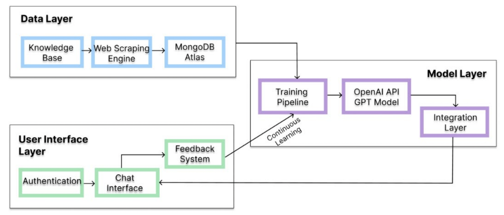
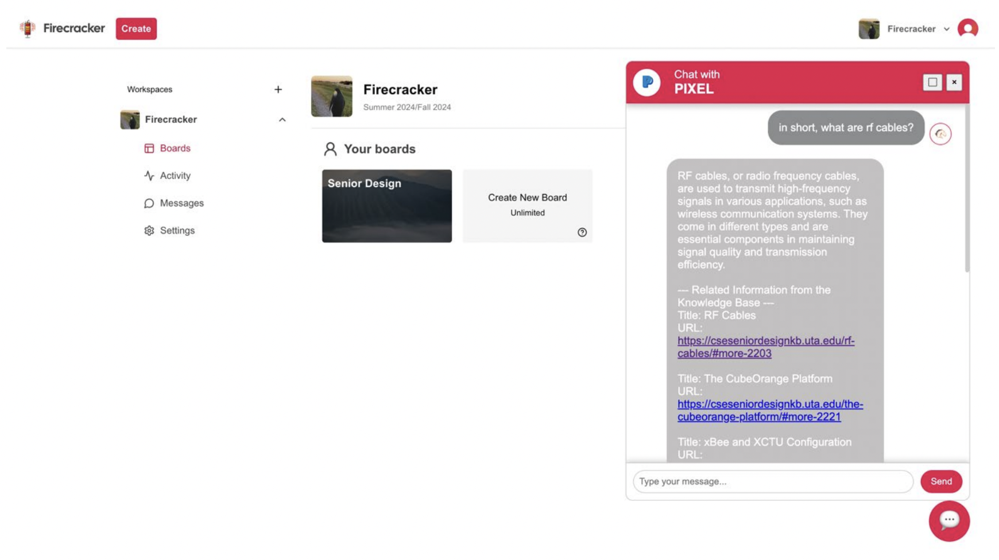

# [Pixel: AI Chatbot for Clear and Effective Senior Design Assistance](https://mavmatrix.uta.edu/honors_fall2024/6/)

**Honors Capstone Thesis (Fall 2024)**  
_Asmin Pothula, Department of Computer Science & Engineering_

---

## Abstract

This research explores the development of an AI-driven chatbot named **Pixel**, specifically designed to assist Computer Science and Engineering Senior Design students by providing immediate, clear, and accurate responses to project-related queries.

While my Senior Design project focuses on developing a "Senior Design Project Management Tool," my Honors Capstone project centers on developing Pixel and integrating it into both the project management tool and the CSE Senior Design Knowledge Base.

Pixel offers guidance on tasks such as:
- Using lab equipment  
- Performing technical procedures  
- Troubleshooting common issues  

By delivering clear, actionable answers, Pixel helps students stay focused on project execution, enhancing collaboration, efficiency, and the overall Senior Design course experience.

---

## Project Goals

- Reduce time spent searching documentation (estimated 10–20% project time lost).
- Provide real-time, accurate responses via a conversational AI.
- Seamlessly integrate the chatbot within the Senior Design Project Management Tool.
- Implement a feedback loop for **continuous learning** and **response improvement**.

---

## Architecture Overview

### Comprehensive Architecture of Pixel  
_Emphasizing the Proposed Feedback Loop for Continuous Learning and Response Improvement_

---

## Implementation Highlights

- **Knowledge Base Source:** CSE Senior Design Knowledge Base (auto-refreshed every 6 weeks).
- **Semantic Search:** OpenAI `text-embedding-ada-002` embeddings + cosine similarity (≥0.8 threshold).
- **Language Model:** GPT-3.5 Turbo (fine-tuned for domain-specific queries).
- **Backend:** Python (FastAPI), MongoDB Atlas.
- **Frontend:** React (integrated within the Senior Design Project Management Tool).
- **Multi-Turn API:** Maintains conversational context across sequential queries.
- **Query Relevance Detection:** Automatically filters out-of-scope queries.

---

### Pixel Integrated within the Senior Design Project Management Tool

---

## Deployment & Usage

1. **Frontend:** Runs as a component inside the Project Management Tool React app.
2. **Backend:** Deployed on FastAPI server, connected to GPT-3.5 and MongoDB Atlas.
3. **Data Refresh:** Automated Python scraper keeps knowledge base embeddings current every 6 weeks.

---

## Future Work

- Expand Knowledge Base coverage (cross-course support).
- Improve handling of highly ambiguous queries.
- Implement automatic learning from **user feedback loop** for continuous model improvement.

---

## Acknowledgements

This project is part of my **Honors Capstone Thesis (Fall 2024)** at the University of Texas at Arlington Honors College.  
It is also integrated with my **Senior Design Project** on building a comprehensive Project Management Tool for CSE Senior Design courses.

---
